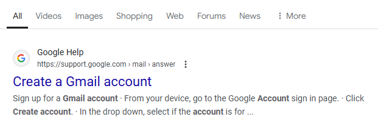
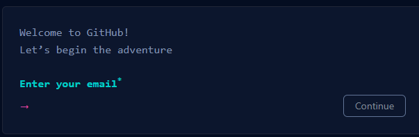
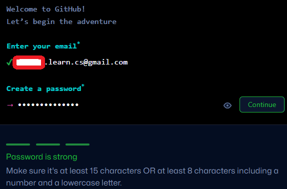
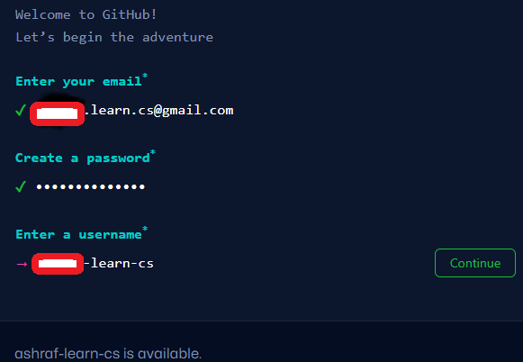
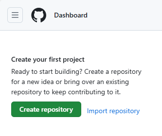
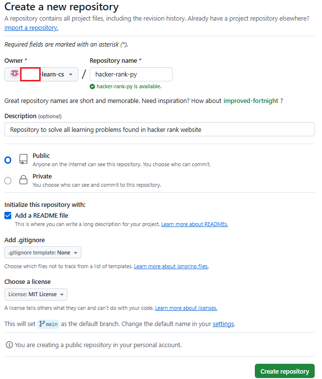
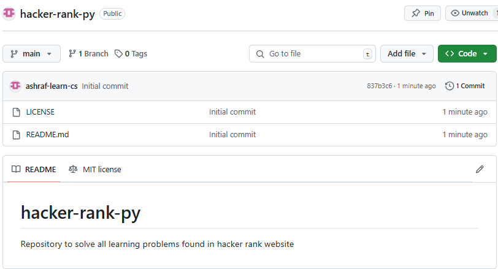
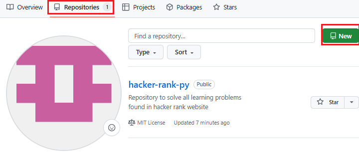
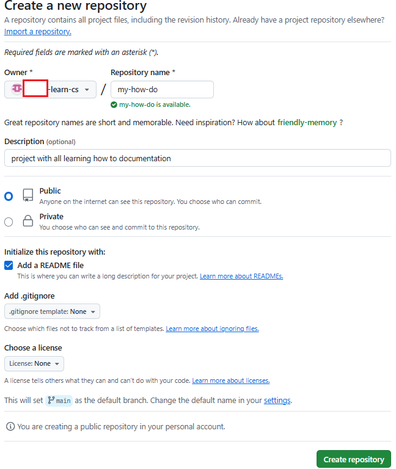

Git Hub How To
===================
> crete GitHub account and your first repository  

1. **Create new GMail account (recommended)** 
   - Browse to [Google](https://www.google.com/) search and type "create Gmail account" 
   - Click on following result 
   
   - Follow the steps to create new e-mail
   - Once you have new e-mil account you can move to create GitHub Account
 
____________________________________________________________________________________

2. **Create GitHub Account**
   - browse to [GitHub](https://github.com/) and click on [Sign up](https://github.com/signup?ref_cta=Sign+up&ref_loc=header+logged+out&ref_page=%2F&source=header-home) 
   - type your new e-mail and click continue
   
   - Enter a password and click continue
   
   - Enter user name and click continue
   
   - verify your account by solving puzzels
   - Enter verification code sent to your e-mail
   - login and selct the free
__________________________________________________________________________________

3. **Create you first repository**
   - click on Create repository

   - fill following information and click create repository
   
   - your new repository should look like the following
   
____________________________________________________________________________________

3. **Create second GitHub Repository**
>this second repository will store all how-to documentation  

   - click on repositories then click new
   
   - call the new repository "my-how-to" as shown below
   