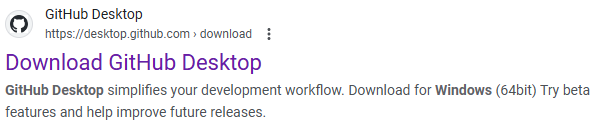
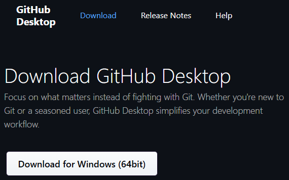
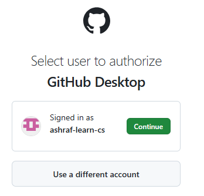
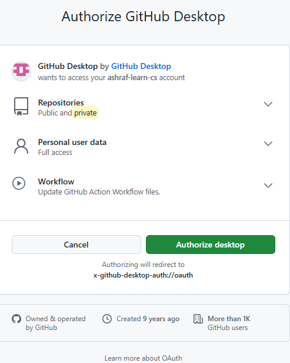
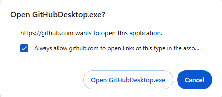
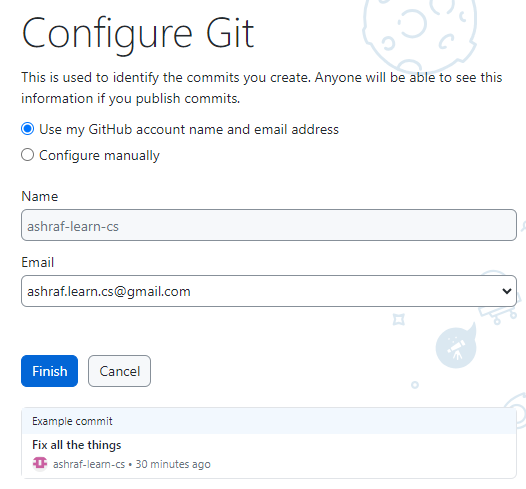
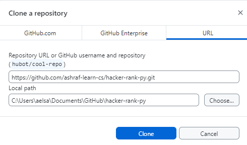

GitHub Desktop How To
=====================
1. **Download GitHub Desktop**
    - Open [Google](https://www.google.com/) Search and type "github desktop for windows"
    - you should get following link as first result, click on it 
    
    - Follwoing web page will show, click on "Download for Windows (64bit)"
    
    - GitHubDesktopSetup-x64.exe file will be downloaded in your download folder
_________________________________________________________________________________
2. **Install GitHub Desktop**
    - double click on **"GitHubDesktopSetup-x64.exe"** in your download folder 
    )
    - click on **"Sign in to GitHub.com"**, this will take you to the browser to signin to GitHub
    - if you already signed in you will see following page, click on **"Continue"**
    
    - following page will show, click on "Authorize desktop"
    
    - next following popup will show, click on **"Open GitHubDesktop.exe"**
    
    - Following GitHubDesktop dialog will , click on **"Finish"**
    
    - folloing screen will show
     
    - Finally click on **"Clone <name>.learn.cs/hacker-rank-py"** and select the location where the repository will be cloned
    
___________________________________________________________________________
3. **Use GitHub Desktop**
>